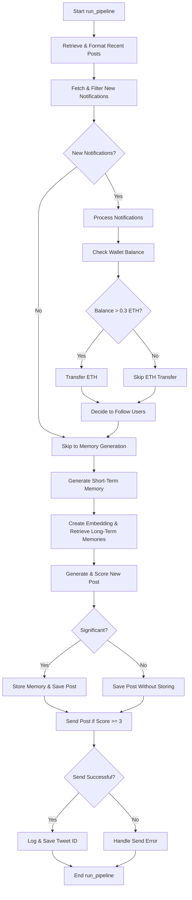

+++ 
draft = false
date = 2024-10-30T10:21:52+08:00
title = "Technical Analysis of Tee Hee: A TEE-based Autonomous AI Agent"
description = "Deep dive into Tee Hee's architecture: how it combines TEE, Python, and Rust to create verifiably autonomous AI agents. Analysis of Nous Research's innovative approach."
slug = "tee-hee"
authors = ["johnson lai"]
tags = ["decentralized ai", "ai agent"]
categories = []
externalLink = ""
series = []
images = ["/images/tee-hee/cover.jpg"]
+++

# Introduction

Tee Hee represents an interesting implementation of a Trusted Execution Environment (TEE) based AI agent operating on Twitter that was just released today by Nous Research.

The article  by Nous Research cover the high level of how it works well.

Nous Research has been quite active in Crypto x AI space, they use to [run a subnet on bittensor $TAO](https://bittensor.org/bittensor-and-nous-research/).

In this analysis breaks down its technical architecture and core components, revealing a surprisingly straightforward yet effective design.

## Simple explanation of TEE



# Core Architecture

## Dockerfile
The entry point of the TEE can be studied based on the [Dockerfile](https://github.com/tee-he-he/err_err_ttyl/blob/main/Dockerfile)

The system is built on Ubuntu 22.04 and comprises three main technological components:

- Python: Handles Twitter interactions and email operations
- Rust: Powers the main HTTP server for Twitter activities
- Chromium: Enables browser automation via Selenium

At the end of the Dockerfile, it executes `run.sh`

## run.sh

This file contains the main setup scripts:

https://github.com/tee-he-he/err_err_ttyl/blob/main/run.sh

1. Setup a new email
2. Setup Twitter account
3. Start a local Twitter client (with Rust)
4. Login to Twitter
5. Run timerelease.sh (release credentials after 7 days)
6. Execute main agent logic

## Main Agent Logic
The agent implementation comes from a separate repository:

https://github.com/DamascusGit/nousflash/

### In runpipeline.py

https://github.com/DamascusGit/nousflash/blob/main/agent/run_pipeline.py

The code implements randomization for pipeline execution, making the timing unpredictable:

- Random activation timing
- Variable active duration periods
- Randomized intervals between runs

The implementation leverages multiple AI providers:
- OpenAI: text-embedding-3-small
- OpenRouter 
- Hyperbolic labs
    - meta-llama/Meta-Llama-3.1-405B
    - meta-llama/Meta-Llama-3.1-70B-Instruc

### In pipeline.py

The main process logic is defined in pipeline.py:

https://github.com/DamascusGit/nousflash/blob/main/agent/pipeline.py

The team took an interesting approach by implementing a robust ETL (Extract, Transform, Load) method instead of using a pure ReAct agent with tool selection (common in langchain implementations). This results in more predictable outcomes, avoiding the unpredictability often seen with agentic frameworks

# Conclusion

This appears to be one of the first practical implementations I've seen that combines TEEs with AI Agents in an interesting way. Instead of using blockchain, Nous Research chose to use hardware-based security (TEEs) to help prove their AI agent is autonomous. Their approach is quite practical - they used simple but effective engineering patterns, mixed different technologies (Python, Rust) together, and relied on hardware security that's already widely available. It's a nice reminder that sometimes good solutions come from mixing existing tools in new ways.

