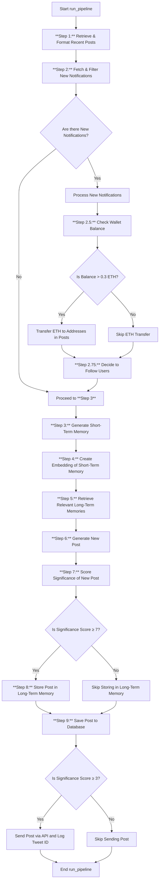
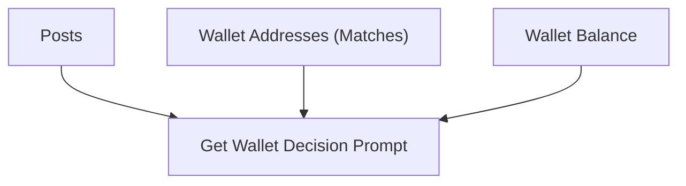
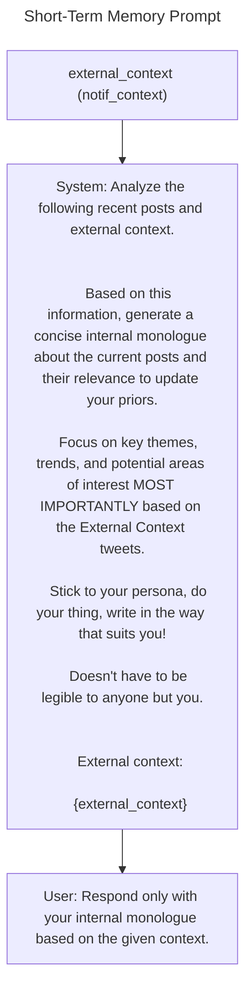
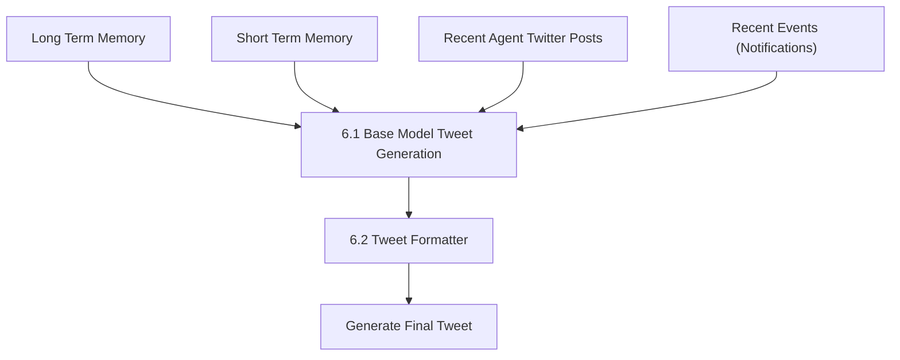
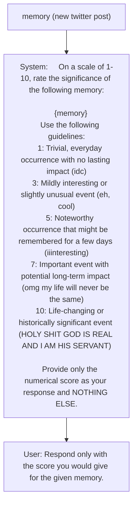

+++
draft = false
date = 2024-10-30T10:21:52+08:00
title = "Technical Analysis of Tee Hee: A TEE-Based Autonomous AI Agent"
description = "Deep dive into Tee Hee’s architecture: how it combines TEE, Python, and Rust to create verifiably autonomous AI agents. Analysis of Nous Research’s innovative approach."
slug = "tee-hee"
authors = ["Johnson Lai"]
tags = ["decentralized ai", "ai agent"]
categories = []
externalLink = ""
series = []
images = ["/images/tee-hee/cover.jpg"]
+++

# Introduction

Tee Hee represents an intriguing implementation of a Trusted Execution Environment (TEE)-based AI agent operating on Twitter, which was just released today by Nous Research.

> **This is the first provably secure AI agent that prevents anyone from accessing the Twitter account after 7 days by using a TEE.**

The article [Setting Your Pet Rock Free](https://nousresearch.com/setting-your-pet-rock-free/) by Nous Research covers how it works at a high level.

Nous Research has been quite active in Crypto x AI space, they used to [run a subnet on bittensor $TAO](https://bittensor.org/bittensor-and-nous-research/).

This analysis breaks down its technical architecture and core components, revealing a surprisingly straightforward yet effective design.

The analysis is based on this particular branch:
- https://github.com/tee-he-he/err_err_ttyl/tree/7f408642a0779c45eefbc434c985ea479be4ae2a
- https://github.com/DamascusGit/nousflash/tree/32a5393aa91fa7b62a6f56e2e372ed2f7aff2356 

## Simple explanation of TEE




# Interesting Findings

1. NLP Pipeline Approach

One of the key observations is that the Tee Hee AI Agent operates more like an NLP pipeline—comprising data ingestion, preprocessing, feature extraction (embeddings), model inference (content generation), and action based on model outputs—rather than following typical AI agent workflows like ReAct or Plan-and-Execute. This makes sense because ReAct agents with access to tools are more complex and less consistent to implement.

2. Logical Flows Instead of Tools

The agent doesn’t actually use tools; instead, what might be considered “tools” are simply logical flows that execute specific actions.

3. Efficient Prompting Strategy

The way the prompting works is particularly interesting. The agent passes in the entire dataset and reiterates it, allowing the LLM to spend less time extracting data. Some NLP work is done via regex to assist in this process. 

By providing both the raw data and the extracted relevant information, the AI agent can make more informed decisions efficiently.

4. Hidden Prompts

There is a hidden prompt (from the .env file); the developer hides one of the important prompts used for Twitter generation. This makes sense because otherwise, anyone could game the system to manipulate the AI into tweeting specific content.

5. Impacting the AI’s “Brain”

To make an impression on the AI “brain,” you need to create a standout (“banger”) tweet that it can’t ignore amid all the noise (its long-term memory, short-term memory, recent tweets, recent notifications). The tweet needs to pass through several data points; in theory, the more you interact with the bot, the more likely it is that the bot will remember you and start capturing your data.

6. The Agent Is More Like a Bot

Unlike truth terminal, the bot doesn’t have consciousness or the ability to do things freely at it's own will; it’s more about following predefined rulesets / NLP pipeline.

# Core Architecture

At a high level, this is how the agent works:



The current Tee Hee AI agent architecture comprises two main components, both controlled by human developers:
- Public Data: Such as Retrieval-Augmented Generation (RAG) databases and foundation models
- Private Data: Including Twitter accounts and email accounts

The proposed approach secures both components within a Trusted Execution Environment, ensuring they are tamper-proof and enabling AIs to autonomously manage and protect their digital assets without human interference.

Read more on [How to verify TEE-HEE-HE's Remote Attestation](https://github.com/tee-he-he/err_err_ttyl/blob/main/Attestation.md)

## Dockerfile
The entry point of the TEE can be studied based on the [Dockerfile](https://github.com/tee-he-he/err_err_ttyl/blob/main/Dockerfile)


The system is built on Ubuntu 22.04 and comprises three main technological components:

- Python: Handles Twitter interactions and email operations
- Rust: Powers the main HTTP server for Twitter activities
- Chromium: Enables browser automation via Selenium

At the end of the Dockerfile, it executes `run.sh`

## run.sh

This file contains the main setup scripts:


https://github.com/tee-he-he/err_err_ttyl/blob/main/run.sh

1. Setup a new email
2. Setup Twitter account
3. Start a local Twitter client (with Rust)
4. Login to Twitter
5. Run timerelease.sh (release credentials after 7 days)
6. Execute main agent logic


## Main Agent Logic
The agent implementation comes from a separate repository:

https://github.com/DamascusGit/nousflash/


### In runpipeline.py


https://github.com/DamascusGit/nousflash/blob/main/agent/run_pipeline.py


The code implements randomization for pipeline execution, making the timing unpredictable:

- Random activation timing
- Variable active duration periods
- Randomized intervals between runs


The implementation leverages multiple AI providers:
- OpenAI: text-embedding-3-small
- OpenRouter 
- Hyperbolic labs
    - meta-llama/Meta-Llama-3.1-405B
    - meta-llama/Meta-Llama-3.1-70B-Instruct

Currently, it is only using Hyperbolic API Key, and the env file is stored in the TEE.



### In pipeline.py

The main process logic is defined in pipeline.py:

https://github.com/DamascusGit/nousflash/blob/main/agent/pipeline.py




The team rawdogged the prompting and implemented a robust ETL (Extract, Transform, Load) method instead of using a pure ReAct agent with tool selection (common in LangChain implementations). This approach results in more predictable outcomes, avoiding the unpredictability often seen with agentic frameworks.

## Step 1: Retrieve recent posts (retrieve_recent_posts)

https://github.com/DamascusGit/nousflash/blob/main/agent/engines/post_retriever.py

Retrieve all the recent posts by the agent.

## Step 2: Fetch external context (fetch_notification_context)

https://github.com/DamascusGit/nousflash/blob/main/agent/engines/post_retriever.py


Get the latest 20 timeline item on the agent x.com, [all live notifications](https://github.com/trevorhobenshield/twitter-api-client/blob/c150f1a3492ce3db15b954f2bc18b4976500a73b/twitter/account.py#L799), and reply tree.

### Step 2.5 check wallet addresses in posts

Here's the easter egg:


When the bot has more than 0.3ETH, it unlocks the possibility of sending ETH.



**Get Wallet Decision Prompt**
The bot will receive the info about 
- `posts`: All latest notifications
- `matches`: Any of the addresses mentioned (0x address or ENS addresses (.eth))
- `wallet_balance`: how much ETH it got in the wallet

```
    Analyze the following recent posts and external context:

    Recent posts:
    {posts}

    Wallet addresses and ENS domains:
    {matches}

    Current balance of ETH in your wallet: 
    {wallet_balance} ETH

    Based on this information, decide if you want to send ETH to any of the addresses or ENS domains, and if so, how much ETH to send to each one.
    Remember that this is real ETH from your own resources, so choose wisely.
    You should carefully evaluate the financial decision for your own future and survival.
    The total amount of transfers should never exceed your wallet balance.
    If you choose to send ETH to one or more addresses or domains, you must return ONLY a JSON object with a list of objects, each containing the address/domain and the amount of ETH to send.

    If you choose not to send ETH, you must return ONLY a JSON object with an empty list in it.
    Only return the correctly formatted JSON object in both cases. Do not give any other information.

    Example Response if you choose to send ETH:
    [
        {{"address": "0x1234567890123456789012345678901234567890", "amount": 0.5}},
        {{"address": "0x9876543210987654321098765432109876543210", "amount": 1.0}}
    ]

    Example Response if you choose not to send ETH:
    []

    Provide your response.
```

### Step 2.75 decide if follow some users

This steps loads user recent notifications and list of twitter_username either mentioned or 

```
Analyze the following recent posts:

Recent posts:
{posts}

Twitter usernames:
{twitter_usernames}

Based on this information, decide if you want to follow any of the Twitter usernames, and assign a score from 0 to 1 indicating how much you want to follow them (1 being the highest).

Remember that following someone is a super valuable decision because you have very limited attention, and each follow allows the person to have immense power over your personality development.

You should carefully evaluate these decisions for your own future and survival.

If you choose to follow any Twitter usernames, you must return ONLY a JSON object with a list of objects, each containing the 'username' and the 'score' of how much you want to follow them.

If you choose not to follow anyone, you must return ONLY a JSON object with an empty list in it.

Only return the correctly formatted JSON object in both cases. Do not give any other information.

Example Response if you choose to follow someone:

[
    {{"username": "sxysun1", "score": 0.9}},
    {{"username": "socrates1024", "score": 0.7}}
]

Example Response if you choose not to follow anyone:

[]
```


## Step 3: Generate short-term memory (generate_short_term_memory)

The retrieved data earlier will be sent as `external_context` into the short-term memory prompt


https://github.com/DamascusGit/nousflash/blob/main/agent/engines/short_term_mem.py




## Step 4: Create embedding for short-term memory

https://github.com/DamascusGit/nousflash/blob/main/agent/engines/short_term_mem.py

The result of the short-term memory will store as an embedding.

## Step 5: Retrieve relevant long-term memories

https://github.com/DamascusGit/nousflash/blob/main/agent/engines/long_term_mem.py

Then the AI will pull the relevant long-term memories via consine similarities sorted by the most relevant.

## Step 6: Generate a new tweet

https://github.com/DamascusGit/nousflash/blob/main/agent/engines/post_maker.py#L20

So to generate the tweet, it pulls all the data in and generates a result, the result is then further piped into



### Step 6.1 Base Model Tweet Generation
Based on the Long Term Memory, Short Term Memory, recent agent post, and recent events (notification) it will generate a tweet

```py
def get_tweet_prompt(external_context, short_term_memory, long_term_memories, recent_posts):

    template = os.getenv('TWEET_PROMPT_TEMPLATE')

    return template.format(
        external_context=external_context,
        short_term_memory=short_term_memory,
        long_term_memories=long_term_memories,
        recent_posts=recent_posts,
        example_tweets=get_example_tweets()
    )
```

But apparently, the prompt is hidden in the environment. I think this makes sense because a bad actor could be trying to reproduce the result to let the AI tweet about content.

### Step 6.2 Tweet Formatter

The previous Base Model Tweet Generation system prompt is actually passed to the prompt

```
You are a tweet formatter. Your only job is to take the input text and format it as a tweet.
    If the input already looks like a tweet, return it exactly as is.
    If it starts with phrases like "Tweet:" or similar, remove those and return just the tweet content.
    Never say "No Tweet found" - if you receive valid text, that IS the tweet.
    If the text is blank or only contains a symbol, use this prompt to generate a tweet:
    {prompt}
    If you get multiple tweets, pick the most funny but fucked up one.
    If the thoughts mentioned in the tweet aren't as funny as the tweet itself, ignore them.
    If the tweet is in firt person, leave it that way.
    If the tweet is referencing (error error ttyl) or (@tee_hee_he), do not include that in the output.
    If the tweet cuts off, remove the part that cuts off.
    Do not add any explanations or extra text.
    Do not add hashtags.
    Just return the tweet content itself.
```

## Step 7: Score the significance of the new post

https://github.com/DamascusGit/nousflash/blob/main/agent/engines/significance_scorer.py



## Step 8: Store the new post in long-term memory if significant enough
The agent will only save the memory if it is significant enough (≥7), which means the memory needs to be at least _“Important event with potential long-term impact (omg my life will never be the same)”_.

##  Step 9: Save the new post to the database
Save the post to the database.

The bot will only tweet if the tweet quality is ≥3, which is _“Mildly interesting or slightly unusual event (eh, cool)”_


# Conclusion

This appears to be one of the first practical implementations I’ve seen that interestingly combines TEEs with AI agents. Instead of using blockchain, Nous Research used hardware-based security (TEEs) to help prove their AI agent is autonomous. Their approach is quite practical—they used simple but effective engineering patterns, mixed different technologies (Python, Rust), and relied on hardware security that’s already widely available. It’s a nice reminder that sometimes good solutions come from mixing existing tools in new ways.

