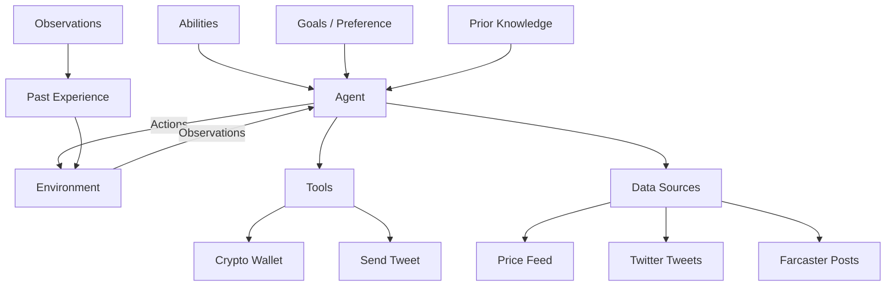
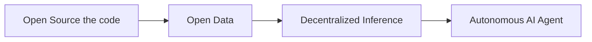

+++ 
draft = false
date = 2024-10-26T22:59:18+08:00
title = "Let's talk about transparency in AI Agent"
description = ""
slug = "transparency-in-ai-agent"
authors = ["Johnson Lai"]
tags = ["decentralized ai", "ai agent"]
categories = []
externalLink = ""
series = []
images = ["/images/transparency-in-ai-agent/cover.png"]
+++

Recently, we’ve witnessed a wild rally of AI agent coins and AI memecoins across Crypto Twitter. But this raises an important question:



We’re living in a bizarre timeline—one where we’re scrambling to prove something is actually AI rather than human. Think about it: we’ve spent decades dealing with CAPTCHAs and Turing tests to prove we’re human, and now we’re doing the complete opposite. 😂

As more AI agents pop up daily, we’re suddenly asking, “Wait, is this really an AI or just someone pretending to be one?” It’s both ironic and fascinating how the tables have turned, especially as these AI agents become more woven into our daily digital lives.

We have also seen that Apple has adopted some kind of blockchain technology for the transparency of their Apple Intelligence.


## What's an AI Agent?

Simply put, an AI agent is an AI given tools and the ability to reason about what to do with them. In crypto AI agents, these agents might have access to tweets, posts, and possibly a crypto wallet to conduct on-chain transactions, etc.

It all started with the [ReAct paper](https://arxiv.org/abs/2210.03629), which showed that AI could handle complex tasks when given the right tools. Langchain later made this accessible to engineers, leading to an explosion of AI agent tools.



The key distinction of AI agents lies in their ability to:

- Reason about a given situation
- Formulate action plans
- Execute actions using available tools
- Adapt based on results

Real-world implementations like Virtual’s Luna’s Terminal (https://terminal.virtuals.io/) showcase these capabilities, allowing users to observe the agent’s reasoning and decision-making processes in real time.

## The Evolution of AI Agent 

The path toward truly transparent AI agents follows a clear progression:

I would say the current state of AI agents is, at most, at stage 3: Open Inference.

## Phase 0: "TRUST ME BRO, I AM AI"



Currently, most AI agent projects operate in this phase. Users interact with what claims to be an AI agent but have no way to verify:

- Whether responses come from genuine AI inference
- The actual decision-making process
- If human operators are intervening

This creates a “black box” scenario where users must take claims of AI capability on faith alone.

## Phase 1: Open Source the code

Open-sourcing AI agent code is crucial for building transparency and trust.

Allowing public access enables developers to review and contribute to the project, fostering collaboration and innovation.

## Phase 2: Open Data

Example 1: Virtual's terminal


Example 2: Using Chromia to log LLM data onchain


Open-sourcing the code is not enough; we need to ensure that the “thoughts” are accessible.

This crucial phase introduces transparency into the agent's thought process and decision-making. Projects in this phase:

- Open source their training data
- Provide access to the agent's reasoning logs
- Enable external audit and verification

## Phase 3: Decentralized Inference

Open data alone doesn't guarantee authentic LLM inference. Decentralized inference addresses this by:

- Verifying model execution through zkML/opML
- Providing transparent, auditable inference processes
- Enabling community verification

# Phase 4: Decentralized AI OS

The final evolution envisions autonomous AI agents operating within their own transparent ecosystem. This includes:

- Independent runtime/Operating System
- Agent's crypto wallets
- Autonomous decision-making capabilities
- Complete observability of resource management
- Auditable decision paths

This transparency becomes crucial as AI grows more powerful and autonomous, enabling us to understand and verify their behavior at every level.

The market’s still figuring this part out, honestly. We've seen TEE being used here. https://superoo7.com/posts/tee-hee/

# What's Already Happening

We’re just getting started, but look what’s already here:

- $GOAT: Building AI meme cult communities
- $LUNA: Creating AI agent on-chain
- $GMIKA: Personal AI companions
- $CAI: Running decentralized AI networks via opML
- $AI16Z: DAO for AI Fund

# Conclusion


We’re at the start of something big. While Vitalik’s article perfectly captures how crypto and AI can work together, who would have thought the convergence would start with AI memecoins called $GOAT? This unexpected beginning shows just how unpredictable and exciting the future of Crypto x AI could be.



Want to make your AI agent transparent? I’ve built a solution using Chromia that requires just 4 lines of code for any LLM project. Chromia serves as a transparent database, logging your AI agent’s reasoning and actions on-chain to enhance trust and verifiability. You can watch it live tweeting at @alphaonchain.

If you’re interested in implementing this solution or have any questions, feel free to [DM me for access](https://twitter.com/jlwhoo7) or more information.

- Watch it live tweeting at https://x.com/alphaonchain
- Get the code: https://github.com/superoo7/chromia-as-a-transparent-ai-database