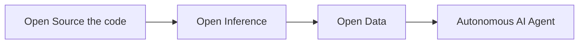

+++ 
draft = false
date = 2024-10-26T22:59:18+08:00
title = "Let's talk about transparency in AI Agent"
description = ""
slug = "transparency-in-ai-agent"
authors = ["Johnson Lai"]
tags = ["machine learning"]
categories = []
externalLink = ""
series = []
images = ["/images/transparency-in-ai-agent/cover.png"]
+++

In recent days, we've witnessed an craze rally of AI Agent coins & AI memecoins across Crypto Twitter. But this raised an important question:



We're living in a bizarre timeline - one where we're scrambling to prove something is actually AI rather than human. Think about it: we've spent decades dealing with CAPTCHAs and Turing tests to prove we're human, and now we're doing the complete opposite 😂

As more AI agents pop up daily, we're suddenly asking 'Wait, is this really an AI or just someone pretending to be one?' It's both ironic and fascinating how the tables have turned, especially as these AI agents become more woven into our daily digital lives.

We also seen that apple has adapt some kind of blockchain technology for their transparency of their apple intelligence


## What's an AI Agent?

Simply put, an AI agent is AI given tools and the ability to reason about what to do with them. In Crypto AI Agent, these agent might have access to tweets, posts, and also possibilities of crypto wallet in order to do onchain transaction etc.

It all started with the [ReAct paper](https://arxiv.org/abs/2210.03629), showing that AI could handle complex tasks when given the right tools. Langchain later made this accessible to engineers, leading to an explosion of AI agent tools.



The key distinction of AI agents lies in their ability to:

- Reason about a given situation
- Formulate action plans
- Execute actions using available tools
- Adapt based on results

Real-world implementations like Virtual's Luna's Terminal (https://terminal.virtuals.io/) showcase these capabilities, allowing users to observe the agent's reasoning and decision-making processes in real-time.

## The Evolution of AI Agent 

The path toward truly transparent AI agents follows a clear progression:

## Phase 1: "TRUST ME BRO, I AM AI"



Currently, most AI Agent projects operate in this phase. Users interact with what claims to be an AI agent, but have no way to verify:

- Whether responses come from genuine AI inference
- The actual decision-making process
- If human operators are intervening

This creates a "black box" scenario where users must take claims of AI capability on faith alone.

## Phase 2: Open Data

Example 1: Virtual's terminal


Example 2: Using Chromia to log LLM data onchain


This crucial phase introduces transparency into the agent's thought process and decision-making. Projects in this phase:

Open source their training data
Provide access to the agent's reasoning logs
Enable external audit and verification

## Phase 3: Decentralized Inference

Open data alone doesn't guarantee authentic LLM inference. Decentralized inference addresses this by:

- Verifying model execution through zkML/opML
- Providing transparent, auditable inference processes
- Enabling community verification

# Phase 4: Decentralized AI OS

The final evolution envisions autonomous AI agents operating within their own transparent ecosystem. This includes:

- Independent runtime/Operating System
- Self-managed crypto wallets
- Autonomous decision-making capabilities
- Complete observability of resource management
- Auditable decision paths

This transparency becomes crucial as AI grow more powerful and autonomous, enabling us to understand and verify their behavior at every level.

The market's still figuring this part out, honestly.

# What's Already Happening

We're just getting started, but look what's already here:

- $GOAT: Building AI communities
- $LUNA: Creating AI personalities on-chain
- $GMIKA: Personal AI companions
- $CAI: Running decentralized AI networks via opML

# Conclusion


We're at the start of something big. While Vitalik's article perfectly captures how crypto and AI can work together, who would have thought the convergence would start with AI memecoins called $GOAT? This unexpected beginning shows just how unpredictable and exciting the future of Crypto x AI could be.

Want to make your AI agent transparent? I've built a solution that needs just 4 lines of code:
- Watch it live tweeting at https://x.com/alphaonchain
- Get the code: https://github.com/superoo7/chromia-as-a-transparent-ai-database