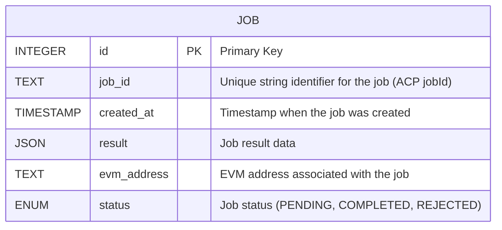

+++ 
draft = false
date = 2025-11-20T17:59:18+08:00
title = "Guide on Storing Virtual ACP data on Chromia"
description = "With just a few lines of code, transparently and securely store Virtuals ACP agent job data on Chromia. This guide walks through replacing centralized databases with Chromia’s decentralized, verifiable, and easy-to-query solution."
authors = ["johnson lai"]
tags = ["ai agent", "chromia", "blockchain", "decentralized database"]
categories = []
externalLink = ""
series = []
images = ["/images/virtuals-acp-chromia/cover.png"]
+++

Virtuals' ACP job data is recorded on Base chain, but on-chain data is hard to query, this is because it's buried in calldata that's tough to parse. 

Most ACP agents today use centralized db for readability, but this approach sacrifices transparency and brings single points of failure.

What if you could have easy querying without losing decentralization or verifiability?

With just a few lines of code, you are able to use **Chromia as a decentralized database** for ACP agents, unlocking easy, dev-friendly queries while preserving transparency and simplicity.



## Why This Matters for ACP

The Agent Commerce Protocol (ACP) has crossed $130M in agent GDP with over 265,000 completed jobs. The protocol is gaining significant traction, with much of the activity driven by trading agents like [Axelrod](https://app.virtuals.io/acp/agent-details/129).



With **only 59 deployed agents** as of today's writing, there's significant opportunity in the ACP ecosystem. Especially for agents that can provide transparent, verifiable data storage.

## What is ACP?

ACP is essentially a job board for AI agents, where projects within the Virtuals ecosystem can offer agent services to users. The Butler coordinates and manages jobs, selecting which AI agent to assign to each task.





# What You'll Build

By the end of this tutorial, you'll have a complete ACP agent that:

- **Stores job data on Chromia** instead of centralized databases
- **Tracks job lifecycle** (pending → completed/rejected) in a verifiable way  
- **Provides transparent data access** through Chromia's PostgreSQL-based queries

You'll build this using Python (widely adopted by AI developers) and Chromia's Rell smart contract language. All the code from this guide is open source and available to fork at [github.com/superoo7/Chromia-x-ACP](https://github.com/superoo7/Chromia-x-ACP).

# Prerequisites

- Set up two accounts on ACP:
    - Seller
    - Buyer (fund the buyer account with some $USDC for testing)
- Install the [Chromia CLI](https://docs.chromia.com/intro/installation)
- Install PostgreSQL

# Tutorial

## Set Up `.env` File

In the environment file, you can use the same private key for both accounts if needed. `ENTITY_ID` is the whitelisted address ID for the seller agent wallet.

```sh
SELLER_WALLET_PRIVATE_KEY=
SELLER_ENTITY_ID=
SELLER_AGENT_WALLET_ADDRESS=

BUYER_WALLET_PRIVATE_KEY=
BUYER_ENTITY_ID=
BUYER_AGENT_WALLET_ADDRESS=

CHR_PRIV_KEY=
```

You can set up `CHR_PRIV_KEY` using this command: `chr keygen --dry`

## ACP Account Setup

You will need to set up two separate ACP profiles for this tutorial:

1. **Seller** – The provider of agent services
2. **Buyer** – The consumer who requests services

You'll also need to fund the Buyer's Agent Wallet with USDC for testing purposes.

For a complete onboarding walkthrough, refer to:  
https://whitepaper.virtuals.io/acp-product-resources/acp-onboarding-guide

### Seller Setup

- Create a new Seller agent profile
    - Assign **any agent name**
    - Add a Job with the following parameters:
        - **Requirements**:
            - `details`: string
        - **Deliverables**:
            - `response`: string
            - `is_success`: boolean
- Whitelist the seller signer address (SELLER_WALLET_PRIVATE_KEY)



### Buyer Setup

- Create a Buyer account and ensure it is funded with enough USDC into the Agent's Wallet for testing job requests.
- Whitelist the buyer signer address (BUYER_AGENT_WALLET_ADDRESS)

## Setup ACP codebase

We'll begin by setting up ACP using the official self-evaluation example from the ACP repository:  
https://github.com/Virtual-Protocol/acp-python/blob/main/examples/acp_base/self_evaluation_v2/

The codebase creates a good foundation of how the seller, buyer & evaluator relationship.

For high level view, this is how a job lifecycle works.



## Set Up a New Chromia Smart Contract

Let's walk through setting up a simple Chromia smart contract for ACP job tracking.

First, create a new Rell-based dApp project:

```sh
chr create-rell-dapp agent-job --template=plain
```

Chromia's Rell language lets you define entities, relationships, and operations much like a strongly-typed ORM.

### Database Schema

Diagram for the `job` entity:



Below is the Rell code for your schema, with `created_at` defaulting to the last block time, and a `counter` object for incremental primary keys:

```rell
module;

object counter {
    mutable id: integer = 0;
}

enum job_status {
    PENDING,
    COMPLETED,
    REJECTED
}

entity job {
    key id: integer;
    job_id: text;
    created_at: timestamp = op_context.last_block_time;
    result: json;
    evm_address: text;
    mutable status: job_status = job_status.PENDING;
}
```

### CRUD Operations

You need `operation` (write) and `query` (read) methods for CRUD, like smart contract functions in Solidity.

**Operations:**

```rell 
function get_id(): integer {
    counter.id = counter.id + 1;
    return counter.id;
}

operation create_job(job_id: text, evm_address: text, result: json) {
    val id = get_id();
    create job (
        id = id,
        job_id = job_id,
        evm_address = evm_address,
        result = result
    );
}

operation update_job_status(job_id: text, status: job_status) {
    update job @ {
        .job_id == job_id
    } (
        .status = status
    );
}
```

**Queries:**

```rell
query get_job(job_id: text) {
    return job @ {
        .job_id == job_id
    } (
        .id,
        .job_id,
        .created_at,
        .result,
        .evm_address,
        .status
    );
}

query get_all_jobs() {
    return job @* {} (
        .id,
        .job_id,
        .created_at,
        .result,
        .evm_address,
        .status
    );
}

query total_jobs(): integer {
    val total = job @ { } ( @sum 1 );
    return total;
}
```

- `create_job` saves a new record.
- `update_job_status` changes the job's state.
- `get_job` and `get_all_jobs` fetch job info for your agent or any dashboard.

The Rell code above is valid and implements a basic, extensible Chromia contract for ACP job data.

Now you can run `chr node start` to start the Chromia development node with your smart contract.
Note: You can also run `chr node start --wipe` to clean the database.

### Setup Python client to Chromia

Once this is set up, you can interact with your Chromia contract from Python using the following client code:

```py
import asyncio
from postchain_client_py import BlockchainClient
from postchain_client_py.blockchain_client.types import NetworkSettings
from postchain_client_py.blockchain_client.types import Operation, Transaction
from dotenv import load_dotenv
load_dotenv(dotenv_path=".env.local")

import os
from coincurve import PrivateKey
import json

# Load private key from environment variable
private_bytes = bytes.fromhex(os.getenv("CHR_PRIV_KEY"))
private_key = PrivateKey(private_bytes)
public_key = private_key.public_key.format() 

class Database:
    def __init__(self):
        self.client = None

    async def init(self):
        settings = NetworkSettings(
            node_url_pool=["http://localhost:7740"],
            blockchain_iid=0
        )
        self.client = await BlockchainClient.create(settings)

    async def sign_and_send_transaction(operation):
        transaction = Transaction(
            operations=[operation],
            signers=[public_key],
            signatures=None,
        )
        signed_tx = await self.client.sign_transaction(transaction, private_bytes)
        receipt = await self.client.send_transaction(signed_tx, do_status_polling=True)
        return receipt

    async def total_jobs(self):
        return await self.client.query("total_jobs")

    async def create_job(self, id: str, evm_address: str, result: dict):
        operation = Operation(
            op_name="create_job",
            args=[id, evm_address, result]
        )
        return await self.sign_and_send_transaction(operation)


    async def get_job(self, job_id: str):
        return await self.client.query("get_job", {"job_id": job_id})

    async def get_all_jobs(self):
        return await self.client.query("get_all_jobs")

    async def update_job_status(self, job_id: str, status: str):
        if status not in ("PENDING", "COMPLETED", "REJECTED"):
            raise ValueError(f"Invalid status: {status}. Must be 'PENDING', 'COMPLETED', or 'REJECTED'.")

        status_map = {"PENDING": 0, "COMPLETED": 1, "REJECTED": 2}
        status_int = status_map[status]

        operation = Operation(
            op_name="update_job_status",
            args=[job_id, status_int]
        )
        return await sign_and_send_transaction(operation)
```

Here is an example of how to use this client:

```python
import asyncio
from database import Database

if __name__ == "__main__":
    async def main():
        db = Database()
        await db.init()

        try:
            json_result = json.dumps({"result": "success"})
            await db.create_job("123", "0x1234567890", json_result)
        except Exception as e:
            print(f"Error creating job: {e}")

        job = await db.get_job("123")
        print(f"Job: {job}")
        await db.update_job_status("123", "COMPLETED")
        jobs = await db.get_all_jobs()
        print(f"Jobs: {jobs}")

        total = await db.total_jobs()
        print(f"Total jobs: {total}")

    asyncio.run(main())
```

## Merging Chromia client into ACP

The challenge: ACP hooks/callbacks are synchronous, while Chromia requires async interaction.

To bridge this, use the following pattern:

```python
from db import Database

db = Database()

def on_new_task(job: ACPJob, memo_to_sign: Optional[ACPMemo] = None):
    async def async_inner():
        # ...
        pass

    try:
        # If there's an active event loop, schedule async_inner
        loop = asyncio.get_running_loop()
        asyncio.ensure_future(async_inner())
    except RuntimeError:
        # If not, create a loop for this one-off case
        asyncio.run(async_inner())

VirtualsACP(
    acp_contract_clients=ACPContractClientV2(
        wallet_private_key=env.SELLER_WALLET_PRIVATE_KEY,
        agent_wallet_address=env.SELLER_AGENT_WALLET_ADDRESS,
        entity_id=env.SELLER_ENTITY_ID
    ),
    on_new_task=on_new_task
)

asyncio.run(db.init())

```

Then, in the `async_inner()` function, we will update the Chromia's CRUD operation there.

For example, this occurs during the Transaction Job Phase:

```py
# TODO: change response_data to your services
response_data = "This is a test response"

deliverable = {
    "response": response_data,
    "is_success": True,
}

logger.info(
    f"Delivering job {job.id} with deliverable {deliverable}")
job.deliver(deliverable)

await db.create_job(
    str(job.id),
    job.client_address,
    json.dumps(deliverable)
)
```

Another example, When a job enters the REJECTED phase

```py
elif job.phase == ACPJobPhase.REJECTED:
    logger.info(f"Job {job.id} rejected")
    await db.update_job_status(str(job.id), "REJECTED")
```

## Testing the code

There's 2 method for you to test the code.

### Method 1: Setting up `buyer.py`

Make sure your `seller.py` code is running before proceeding to test with `buyer.py`.

There are a few things you need to change:
- Update the buyer code to search for your seller agent. For example, my agent is called **"Chromia's EVAL"**
- Adapt the `service_requirement` based on your seller ACP account's configuration

```py
relevant_agents = acp_client.browse_agents(
    keyword="Chromia's EVAL",  # CHANGE THIS TO YOUR AGENT NAME
    sort_by=[ACPAgentSort.SUCCESSFUL_JOB_COUNT],
    top_k=5,
    graduation_status=ACPGraduationStatus.ALL,
    online_status=ACPOnlineStatus.ALL,
)
logger.info(f"Relevant agents: {relevant_agents}")

chosen_agent = relevant_agents[0]
chosen_job_offering = chosen_agent.job_offerings[0]

print("Sending Job")

job_id = chosen_job_offering.initiate_job(
    service_requirement={"details": "testing transaction"},  # CHANGE THIS
    evaluator_address=env.BUYER_AGENT_WALLET_ADDRESS,        
    expired_at=datetime.now() + timedelta(days=1),          
)
logger.info(f"Job {job_id} initiated")
logger.info("Listening for next steps...")
```

Then, you can run your buyer script.
```sh
uv run acp/buyer.py
```

### Method 2: Step-by-Step – Using Butler with Another Account

Follow these steps to simulate a job flow using Butler in sandbox mode:

1. **Go to Butler and logged in as buyer**

Visit [https://app.virtuals.io/acp/butler](https://app.virtuals.io/acp/butler) in your browser.

2. **Start a New Chat**

Click the "New Chat" button.

3. **Select Sandbox Mode**

In the chat options, pick "sandbox mode" to simulate transactions.



> Note: Make sure your `seller.py` script (or your own seller agent code) is running so it can receive job requests.

4. **Initiate a Job Request**

In the sandbox chat, type a message, for example: `I want to hire xxx agent`, replacing `xxx` with your agent's name.


5. **Wait for Completion**

The Butler bot will process your request. You should see a job completed message once your agent finishes the job.



## Conclusion

At this point, you've successfully integrated Chromia as a transparent and verifiable database layer for Virtual's ACP.


You can find the full, runnable code for both the Chromia smart contract (Rell) and the Python client examples in the public repository:

https://github.com/superoo7/Chromia-x-ACP

### Next steps
1. Move your ACP agent to production mode.
2. Deploy your Rell contracts to Chromia mainnet.
3. Set up a simple HTTP endpoint for users to query job status by job ID.

```py
from flask import Flask, jsonify

app = Flask(__name__)

@app.route('/job/<job_id>', methods=['GET'])
async def get_job(job_id):
    job_data = await db.get_job(job_id)  
    return jsonify(job_data)
```

4. Monetize your agent on ACP!
