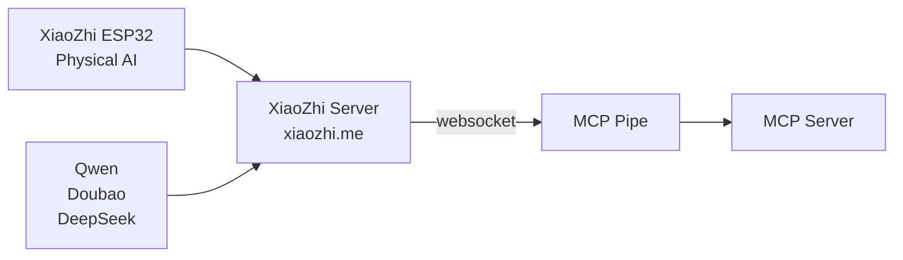

+++ 
draft = false
date = 2025-06-05T17:59:18+08:00
title = "XiaoZhi: The Open Source $15 AI Robot OS That's Changing Physical AI"
description = "Explore XiaoZhi, the viral open source hardware OS making affordable, customizable AI companions a reality. Build your own ESP32-based AI robot with just $15 and join the Physical AI revolution."
slug = "xiaozhi-open-source-ai-robot-os-guide"
authors = ["Johnson Lai"]
tags = ["ai agent"]
categories = []
externalLink = ""
series = []
images = ["/images/xiaozhi-open-source-ai-robot-os-guide/cover.png"]
+++

> Remember when the [Rabbit R1 ($199)](https://www.rabbit.tech/) and [Humane AI Pin ($700+subscription)](https://support.humane.com/hc/en-us/articles/34243204841997-Ai-Pin-Consumers-FAQ) promised to revolutionize AI hardware? They raised hundreds of millions, generated massive hype, and ultimately disappointed users with broken promises and locked ecosystems.



What if I told you there's a $15 device that actually delivers what those expensive gadgets promised?

I discovered it during a recent trip to Shanghai, a viral AI physical robot called [**XiaoZhi (小智)**](https://github.com/78/xiaozhi-esp32) that's taking China by storm while remaining virtually unknown in the West. According to reports, XiaoZhi has already crossed the [100,000 active device threshold](https://pandayoo.com/post/a-chinese-10-ai-hardware-sold-100000-units-in-months/) in just a few months, potentially making it the first AI-native hardware ecosystem to reach such numbers this quickly.



As someone who spent a decade tinkering with Arduino and Raspberry Pi setups that cost hundreds and required weeks of assembly, XiaoZhi felt like discovering a secret. While Western companies burn through venture capital on closed, overpriced hardware, the Chinese have cracked the code on truly affordable physical AI, what's being called the **AIoT revolution** (AI + IoT).

This isn't just another gadget trend. XiaoZhi represents a fundamental shift toward democratized AI hardware, where innovation happens at the grassroots level rather than in corporate boardrooms. The project, originally a personal experiment by education tech entrepreneur [Huang Guan (黄冠)](https://github.com/78), has evolved into a massive community-driven ecosystem with monthly growth rates hitting 300%.

*For the cost of a nice lunch, you can have a fully functional AI companion sitting on your desk, one that actually works 🤯*

## What exactly is XiaoZhi and why should you care?

**Think "Android for physical AI robots"**



You know how Android made smartphones accessible by creating a unified platform that works across thousands of different devices? [XiaoZhi does the same thing for AI robots](https://xiaozhi.dev/en/). Whether you want a cute desk companion, a dog-shaped assistant, or something completely custom, they all run the same underlying system.

> For clarity, I will refer to the operating system of the XiaoZhi framework as "XiaoZhi OS" throughout this article.

I've seen versions that look like astronauts, some that resemble digital pets, and others that are just simple LCD screens with microphones. The magic isn't in the hardware, it's in how XiaoZhi connects all these different form factors to powerful AI services in the cloud.

**How it actually works (and why it's brilliant)**



Here's what blew my mind: You can purchase a prebuilt and 3D-printed XiaoZhi device with an ESP32 board, microphone, and LCD screen for around $15 on Taobao. Try searching for "小智机器人." Most sellers are friendly, and you can ask them whether it's compatible with XiaoZhi and which model to flash for customization. Most devices already come with XiaoZhi pre-installed.

It connects to either [xiaozhi.me](https://xiaozhi.me) (their cloud service) or your own self-hosted server. This compact device can have conversations, remember things about you, control your smart home, and even assist with work tasks, no breadboarding or assembly required.

The secret sauce is something called [MCP (Model Context Protocol by Anthropic)](https://modelcontextprotocol.io). This lets your little robot connect to all sorts of services and tools, kind of like how your smartphone can install apps. 

If you want to explore MCP with XiaoZhi, check out this example: [MCP Calculator Example](https://github.com/78/mcp-calculator). It shows how to use MCP to expand XiaoZhi's features and is a great resource for learning how to connect different services and tools to your XiaoZhi device.

## Getting your hands on XiaoZhi hardware (without the language barrier)

**The easy route: Pre-built devices**

Since you're probably not looking to solder components (I get it), here are the best ready-to-go options:

**For the "I just want it to work" crowd:** Search Amazon or eBay for "ESP32-S3-BOX-3" ($50-80). This is [Espressif's official development kit](https://www.espressif.com/en/products/devkits/esp32-s3-box) with a touchscreen, dual mics, and excellent English documentation. 



I personally got started with the [SeeedStudio SenseCap Watcher](https://www.seeedstudio.com/SenseCAP-Watcher-W1-A-p-5979.html), which has an [official guide on how to flash it with XiaoZhi OS](https://wiki.seeedstudio.com/flash_watcher_agent_firmware/).

> **Note for Mac/Linux users:** Most guides are written for Windows. As a Mac user, I sometimes find it challenging to get started due to limited documentation for Mac/Linux systems.

**For the adventurous:** Build your own XiaoZhi device using the ESP32 Budget Version. Check the [development docs](https://xiaozhi.dev/en/docs/usage/esp32-budget-version/) for guidance.

## Setting up your OTA server (or letting someone else do it)

**The lazy approach: Use xiaozhi.me**

Honestly, if you just want to play around, use their [free cloud service](https://xiaozhi.me). It supports multiple languages, has a web interface for managing your devices, and requires zero server setup. 

*Yes, it's hosted in China, so consider your privacy preferences.*

**The control-freak approach: Self-hosting**

This is where things get interesting. There are server implementations in Python, Java, and Go. I'd recommend the Python one ([xiaozhi-esp32-server](https://github.com/xinnan-tech/xiaozhi-esp32-server)) because it's the most feature-complete and has decent documentation.

You can run it on a Raspberry Pi, your old laptop, or deploy it on a cloud server. The Python version supports different AI models (including local ones with [Ollama](https://ollama.ai)), has a nice web interface, and integrates well with home automation systems.

**The MCP magic**

Here's where XiaoZhi gets really powerful. [MCP](https://modelcontextprotocol.io) lets your robot connect to all sorts of services:
- Control smart home devices 
- Search your documents and emails
- Connect to productivity tools
- Even interact with your computer directly

For more inspiration and ideas on what you can achieve with MCP, check out the [Awesome MCP Servers](https://github.com/punkpeye/awesome-mcp-servers) repository. It provides a curated list of projects and examples that demonstrate the versatility and power of MCP in various applications. Whether you're looking to enhance your smart home setup or explore new productivity tools, this resource is a great starting point.

Setting this up requires some technical knowledge, but the possibilities are endless.

## Real-world use cases (beyond just "cool gadget")

**Business applications that actually make sense**

I've been thinking about this since my Shanghai trip, and the business applications are compelling:

**Customer loyalty programs:** Imagine a small AI companion in your coffee shop that recognizes regular customers, checks their loyalty points, and suggests new drinks. Way more engaging than a boring app.

**Employee tools:** A desk companion that knows your schedule, can look up company information, and helps with routine tasks. It's like having a personal assistant that costs less than a nice dinner.

**Smart buttons for everything:** Need a quick way for employees to reorder supplies? Customers to request service? Kids to call for help? A voice-activated button that costs $15 beats any expensive IoT solution.

**The digital pet angle**



Remember Tamagotchis? XiaoZhi can create way more sophisticated virtual companions. They remember conversations, develop personalities over time, and provide actual utility beyond just being cute. The emotional connection aspect has been crucial to XiaoZhi's viral success, [videos showcasing empathetic AI conversations](https://pandayoo.com/post/a-chinese-10-ai-hardware-sold-100000-units-in-months/) have racked up millions of likes on Chinese social platforms.

This represents the practical side of the **AIoT (AI + IoT) revolution**: instead of "smart" devices that require apps and complex setup, XiaoZhi offers natural language interaction that feels genuinely conversational. It's AI hardware that works the way people intuitively expect it to.

## How to get started

**Choose your adventure level**

The beauty of XiaoZhi is that you can start at whatever technical level you're comfortable with:

**Complete beginner**: Start with a pre-built device from Taobao or AliExpress. Search for "小智机器人" or "XiaoZhi ESP32." These typically cost $15-25 and come ready to use.

**Some assembly required**: Get an ESP32-S3 development board like the SenseCap Watcher or ESP32-S3-BOX-3, then follow the flashing guides to install XiaoZhi OS.

**DIY enthusiast**: Build your own using the ESP32 Budget Version with custom 3D-printed cases and components.

**Development environment setup**

If you're going the DIY route, you'll need to set up the ESP-IDF (Espressif IoT Development Framework) to compile and flash firmware. This is where most Western developers hit their first hurdle due to limited English documentation.

> **What is ESP-IDF?** ESP-IDF is the official development framework for ESP32 chips. While powerful, it can be complex for beginners, hence the simplified flash tools mentioned below.

**Helpful resources for getting started:**
- **Mac users**: [Mac下小智AI本地环境部署](https://blog.csdn.net/qq_45171581/article/details/146896687) - A comprehensive Chinese tutorial that I found invaluable
- **Official documentation**: [xiaozhi.dev/en/docs/usage/](https://xiaozhi.dev/en/docs/usage/) - The primary English docs
- **FAQ and tutorials**: [Community wiki](https://ccnphfhqs21z.feishu.cn/wiki/F5krwD16viZoF0kKkvDcrZNYnhb) (Chinese)
- **Simplified flash tools**: [Flash without ESP-IDF](https://ccnphfhqs21z.feishu.cn/wiki/Zpz4wXBtdimBrLk25WdcXzxcnNS) - For those who want to avoid the complexity

**My recommendation**: Start with a pre-built device to experience the platform, then graduate to DIY builds once you understand what you want to customize.

## The current reality and future potential

**Why this isn't mainstream in the West yet**

The biggest barrier is language and community. Most of the documentation, forums, and support are in Chinese. The hardware suppliers are mostly Chinese companies unfamiliar to Western consumers. And honestly, the whole ecosystem feels like "insider knowledge" right now.

But that's also where the opportunity lies. The technical foundation is solid, the economics are compelling, and the possibilities are endless. It just needs someone to bridge the cultural and language gap.

While Chinese tariffs might pose a challenge, you can always work with local manufacturers using the available 3D printing files and parts schematics to build devices yourself.

**What excites me most**

Coming from the Arduino/Raspberry Pi world, XiaoZhi feels like the next evolution. Instead of spending weeks getting basic speech recognition working, you get sophisticated AI conversations out of the box. Instead of managing local processing limitations, you leverage cloud AI that gets better every month.

This is what the **AIoT revolution** actually looks like in practice: seamless integration of AI capabilities into affordable, customizable hardware. Unlike the failed attempts by Rabbit R1 and Humane AI Pin, XiaoZhi succeeds because it embraces community innovation rather than fighting it. The [grassroots approach has enabled 300% monthly growth](https://pandayoo.com/post/a-chinese-10-ai-hardware-sold-100000-units-in-months/) while keeping costs impossibly low.

The [open-source MIT license](https://github.com/78/xiaozhi-esp32/blob/main/LICENSE) means you can build commercial products without worrying about licensing fees. The low hardware costs make it viable for applications that could never justify expensive solutions.

**Getting started is easier than you think**

I spent years thinking AI hardware meant either expensive development kits (hello, $500+ Nvidia Jetson boards) or toys with limited functionality. XiaoZhi changed that perspective completely by taking a different approach: instead of trying to cram everything into expensive edge AI hardware, it smartly balances local processing for responsiveness with cloud AI for the heavy lifting.

The learning curve exists, but it's gentler than you'd expect. The [community is helpful](https://github.com/78/xiaozhi-esp32/issues) (if you can navigate the language barrier), the [documentation is improving](https://xiaozhi.dev/en/docs/), and the technology just works.

If you've been curious about AI hardware but intimidated by the complexity and cost, XiaoZhi might be exactly what you're looking for. Start with a simple device, use the cloud service, and see where your imagination takes you.

---

*Want to discuss AI hardware trends or share your XiaoZhi build? Hit me up on X/Twitter [@jlwhoo7](https://x.com/jlwhoo7). Follow the [main GitHub repository](https://github.com/78/xiaozhi-esp32) for the latest developments.*